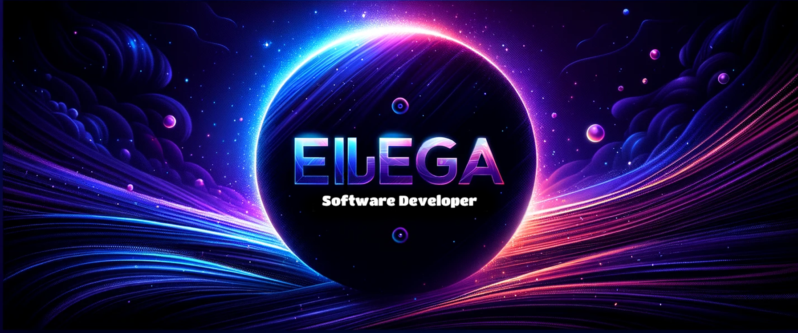

  

<h1 align="center">Hola, soy Javier Perez 👋</h1>

  Desarrollador de Software apasionado por Python, Flask, C#, HTML, CSS, Unity y SQL.

## Sobre Mí 🚀
Soy un desarrollador de software con experiencia en múltiples tecnologías. Me encanta crear soluciones innovadoras y eficientes. Aquí encontrarás algunos de mis proyectos y colaboraciones.

- 🔭 Actualmente estoy trabajando en [PicOptimizer]([link_al_proyecto](https://picoptimizer.1.us-1.fl0.io)).
- 🌱 Aprendiendo constantemente sobre nuevas tecnologías y mejores prácticas.
- 👯 Busco colaborar en proyectos interesantes y desafiantes.
- 💬 Pregúntame sobre Python, Flask, C#, Unity, SQL, HTML y CSS.
- 📫 Cómo contactarme: [playgames.j.g17@gmail.com](mailto:playgames.j.g17@gmail.com)

## Tecnologías y Herramientas 🛠️

  
  
  

## Estadísticas de GitHub 📊

  

## Proyectos Destacados 🌟
- [Nombre del Proyecto 1](link_al_proyecto_1) - Descripción breve del proyecto.
- [Nombre del Proyecto 2](link_al_proyecto_2) - Descripción breve del proyecto.

## Contacto y Redes Sociales 📬

  
  

