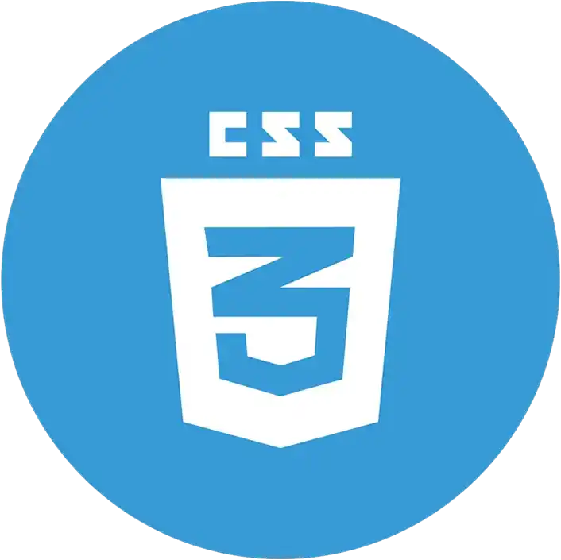

  

<h1 align="center">Hola, soy Javier Perez 👋</h1>

  Desarrollador de Software apasionado por Python, Django, Flask, C#, Docker, HTML, CSS, Unity, SQL, PostgreSQL, MySQL.

## Sobre Mí 🚀
Soy un desarrollador de software con experiencia en múltiples tecnologías. Me encanta crear soluciones innovadoras y eficientes. Aquí encontrarás algunos de mis proyectos y colaboraciones.

- 🔭 Actualmente estoy trabajando en el desarrollo de un videojuego para la empresa Danone´s.
- 🌱 Aprendiendo constantemente sobre nuevas tecnologías y mejores prácticas.
- 🤝 Busco colaborar en proyectos interesantes y desafiantes.
- 💬 Pregúntame sobre Python, Django, Flask, C#, Docker, HTML, CSS, Unity, SQL, PostgreSQL, MySQL.
- 📫 Cómo contactarme: [eljegadev@gmail.com](mailto:eljegadev@gmail.com)

## Tecnologías y Herramientas 🛠️

  
  
  
  
  
  
  

## Estadísticas de GitHub 📊

  

## Proyectos Destacados 🌟
- [Análisis Automático de Radiografías con IA]([link_al_proyecto_1](https://multiclass-model-detection.fly.dev/analizar)) - El desafío fue abordado mediante la implementación de ResNet50, una arquitectura de red neuronal convolucional que ha demostrado ser altamente efectiva en la clasificación de imágenes.
- [Sistema de Gestión]([link_al_proyecto_1](https://github.com/eljega/sistema-de-datos)) - Creación de un sistema de base de datos con Python, Django, PostgreSQL, Docker.
- [PythonEnAccion]([link_al_proyecto_1](https://github.com/eljega/PythonEnAccion)) - Una colección exhaustiva de scripts en Python desde utilidades para automatización de tareas hasta soluciones para problemas complejos, diseñados para hacer tu vida más fácil y productiva.
- [Traducción y Transcripción]([link_al_proyecto_1](https://github.com/eljega)) - Aplicación de Traducción y Transcripción de Voz en Tiempo Real
- [PicOptimizer]([link_al_proyecto_1](https://picoptimizer.1.us-1.fl0.io)) - Diseño de un convertido y optimizador de imágenes en línea, demostrando
habilidades en desarrollo web y manipulación de imágenes.
- [My_Portfolio]([link_al_proyecto_2](https://my-portfolio-eljega.vercel.app)) 

## Contacto y Redes Sociales 📬

  

